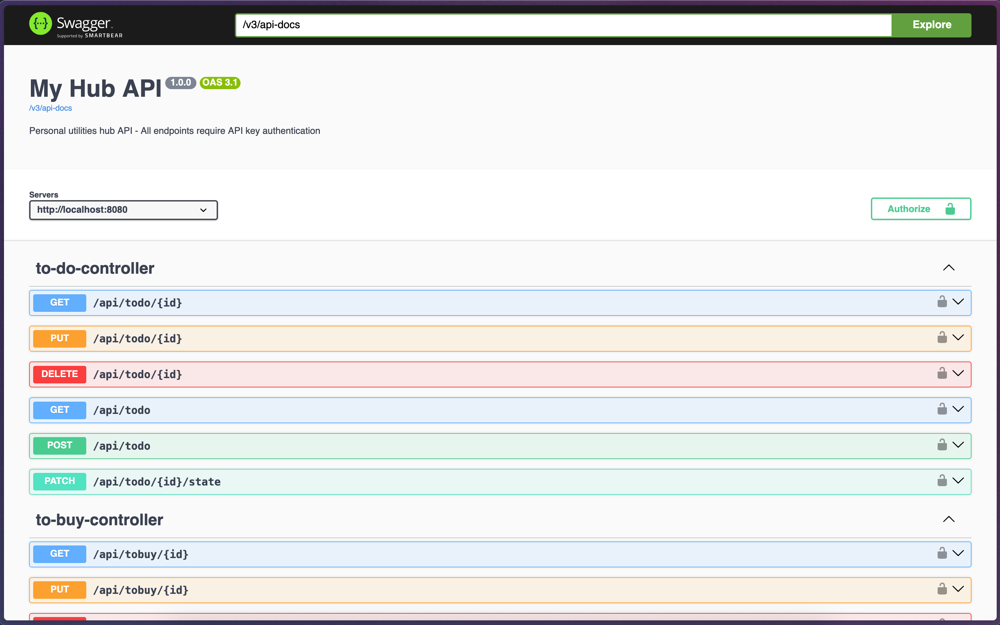

# EHub Server

<p align="center">
  
</p>

# E-Hub Mobile Application

E-Hub is a project designed to create tools and services that simplify and improve my daily life.
Its goals are twofold:

1. To explore and experiment with a wide range of technologies, gaining hands-on experience and learning new skills.
2. To make the platform accessible across multiple environments and devices:
    - [x] [Web Server](https://github.com/Eric-Philippe/E-Hub-Server) - v1.0.0 released
    - [x] [Grafana Dashboards](https://github.com/Eric-Philippe/E-Hub-Server/tree/main/grafana)
    - [x] [Mobile application (Android)](https://github.com/Eric-Philippe/E-Hub-Mobile) - v1.0.0 released
    - [ ] Samsung Tizen application (Next)
    - [ ] Desktop application
        - [ ] MacOS
        - [ ] Windows
        - [ ] Linux
    - [ ] Android TV application
    - [ ] Receipt printer

---

This repository contains the spring Boot API built with Kotlin and Java 21, featuring JPA, PostgreSQL, Flyway migrations, and OpenAPI documentation.



## Technologies Used

- **Language**: Kotlin
- **Framework**: Spring Boot 3.5.5
- **Java Version**: 21
- **Database**: PostgreSQL
- **Migration**: Flyway
- **Documentation**: OpenAPI/Swagger UI
- **Build Tool**: Gradle

## Prerequisites

- Docker and Docker Compose (for containerized deployment)
- Java 21 (for local development)
- PostgreSQL (for local development)

## Docker Deployment

### Building the Docker Image

```bash
docker build -t ehub-server .
```

### Running the Container

#### Basic Run
```bash
docker run -p 8080:8080 ehub-server
```

#### Run with Environment Variables
```bash
docker run -p 8080:8080 \
  -e SPRING_DATASOURCE_URL=jdbc:postgresql://host.docker.internal:5432/ehub \
  -e SPRING_DATASOURCE_USERNAME=your_username \
  -e SPRING_DATASOURCE_PASSWORD=your_password \
  ehub-server
```

#### Run with Docker Compose (Recommended)

Create a `docker-compose.yml` file:

```yaml
version: '3.8'
services:
  ehub-server:
    build: .
    ports:
      - "8080:8080"
    environment:
      - SPRING_DATASOURCE_URL=jdbc:postgresql://postgres:5432/ehub
      - SPRING_DATASOURCE_USERNAME=ehub
      - SPRING_DATASOURCE_PASSWORD=password
    depends_on:
      - postgres
    volumes:
      - ./resources:/app/external-resources  # Access to resources folder

  postgres:
    image: postgres:15
    environment:
      - POSTGRES_DB=ehub
      - POSTGRES_USER=ehub
      - POSTGRES_PASSWORD=password
    ports:
      - "5432:5432"
    volumes:
      - postgres_data:/var/lib/postgresql/data

volumes:
  postgres_data:
```

Then run:
```bash
docker-compose up -d
```

### Accessing Resources

The resources folder is copied to `/app/resources/` inside the container and can be accessed by:

1. **Mounting as volume**: Add `-v ./src/main/resources:/app/external-resources` to your docker run command
2. **Direct access**: The resources are already copied into the container at `/app/resources/`

## Local Development

### Setup

1. Clone the repository
2. Ensure Java 21 is installed
3. Set up PostgreSQL database
4. Copy `application.example.properties` to `application.properties` and configure your database settings

### Running Locally

```bash
./gradlew bootRun
```

### Building Locally

```bash
./gradlew clean build
```

### Running Tests

```bash
./gradlew test
```

## API Documentation

Once the application is running, you can access:

- **Swagger UI**: http://localhost:8080/swagger-ui.html
- **OpenAPI JSON**: http://localhost:8080/v3/api-docs

## Database Migrations

The application uses Flyway for database migrations. Migration scripts are located in `src/main/resources/db/migration/`.

Migrations run automatically on application startup.

## Configuration

The application uses Spring Boot's configuration system. Key configuration files:

- `src/main/resources/application.properties` - Main configuration
- `src/main/resources/application.example.properties` - Example configuration template

## Health Check

The application includes Spring Boot Actuator endpoints:

- **Health Check**: http://localhost:8080/actuator/health

## Security

The application includes Spring Security configuration. Ensure proper authentication and authorization are configured for production use.